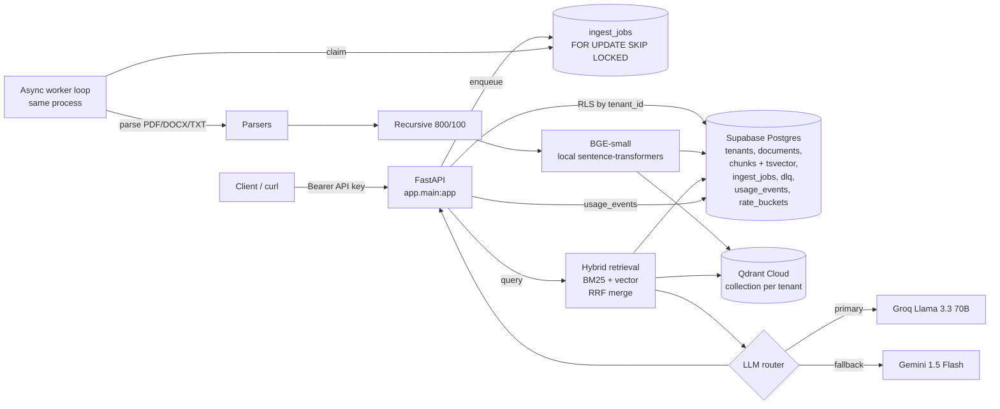

# Multi-Tenant Enterprise RAG Platform

A working implementation of a multi-tenant Retrieval-Augmented Generation backend
covering document ingestion, hybrid retrieval, RAG synthesis with citations,
tenant isolation, rate limiting, cost tracking, and provider failover.

> **Hosted demo:** https://msmandy94-rag-platform.hf.space
> **Repo:** https://github.com/msmandy94/rag-platform

## Graders — quick start

A demo tenant is pre-seeded. Use this API key against the hosted demo:

```bash
API=https://msmandy94-rag-platform.hf.space
KEY=rag_su0VbkNg1eGg1iW15wPokMSxSFJkIV8SUwmLLLnBjzQ

# 1. Upload a document
curl -sS -X POST "$API/v1/documents" \
  -H "Authorization: Bearer $KEY" \
  -F "file=@/path/to/your.pdf;type=application/pdf"

# 2. Wait until status == "indexed"
curl -sS "$API/v1/documents/<id>" -H "Authorization: Bearer $KEY"

# 3. Ask a question
curl -sS -X POST "$API/v1/query" \
  -H "Authorization: Bearer $KEY" -H "Content-Type: application/json" \
  -d '{"question":"What does this document say about X?","top_k":5}'

# 4. See per-tenant usage / cost
curl -sS "$API/v1/usage" -H "Authorization: Bearer $KEY"
```

If you want your own tenant, ping the admin endpoint with the
`ADMIN_TOKEN` (the deployer holds this) — see [Admin section](#admin).

The Hugging Face Spaces frontmatter at the top of this file lets the same repo
double as the deployment manifest — push the repo to a Space and HF builds and
runs the Dockerfile.

---

## Architecture



**Components**

| Concern              | Implementation                                                          |
|----------------------|--------------------------------------------------------------------------|
| API + Worker         | FastAPI process; worker is an asyncio task started in lifespan          |
| Metadata + Queue     | Supabase Postgres (`asyncpg` pool, `FOR UPDATE SKIP LOCKED` queue)      |
| Vector store         | Qdrant Cloud, **collection-per-tenant** for hard isolation              |
| BM25                 | Postgres `tsvector` + `ts_rank` (no extra service)                      |
| Embeddings           | `BAAI/bge-small-en-v1.5` via `sentence-transformers` (local, free)      |
| LLM                  | Groq Llama 3.3 70B → Gemini 1.5 Flash failover (`tenacity`)             |
| AuthZ                | Tenant API key (SHA-256 hashed); Postgres RLS using `app.tenant_id`     |
| Rate limit           | Per-tenant token bucket persisted in Postgres                            |
| Idempotency          | `(tenant_id, content_hash)` unique index                                |
| Retry / DLQ          | `attempts`/`max_attempts` + dedicated `dlq` table                       |
| Cost tracking        | `usage_events` table; cost in micro-USD using current public pricing    |

---

## Endpoints

```
POST /admin/tenants            (admin token)   create a tenant + return its API key
POST /v1/documents             (tenant token)  multipart upload — pdf | docx | txt
GET  /v1/documents/{id}        (tenant token)  ingestion status
POST /v1/query                 (tenant token)  RAG with citations
GET  /v1/usage                 (tenant token)  30-day token / cost breakdown
GET  /health
```

### Admin

To create a new tenant:

```bash
curl -sS -X POST "$API/admin/tenants" \
  -H "Authorization: Bearer $ADMIN_TOKEN" \
  -H "Content-Type: application/json" \
  -d '{"name":"my-tenant","rate_limit_query_rpm":120}'
# -> returns {tenant_id, name, api_key} -- the api_key is only ever returned once
```

---

## Local development

```bash
# Python 3.12 via uv (https://docs.astral.sh/uv/)
uv venv --python 3.12
uv pip install -e .

# Optional: local Postgres + Qdrant via docker compose
docker compose up -d

# Configure env
cp .env.example .env
# Fill in DATABASE_URL, QDRANT_URL, QDRANT_API_KEY, GROQ_API_KEY, GEMINI_API_KEY, ADMIN_TOKEN

# Apply schema
.venv/bin/python -m app.cli migrate

# Seed a demo tenant
.venv/bin/python -m app.cli seed-demo
# -> prints tenant_id and api_key — copy the api_key

# Run API + embedded worker
.venv/bin/python -m app.cli api
# -> http://localhost:7860
```

### curl examples

```bash
API=http://localhost:7860
KEY=rag_xxx   # api key from seed-demo

# Upload a PDF
curl -sS -X POST "$API/v1/documents" \
  -H "Authorization: Bearer $KEY" \
  -F "file=@./your.pdf;type=application/pdf"

# Check status (poll until status == "indexed")
curl -sS "$API/v1/documents/<doc_id>" -H "Authorization: Bearer $KEY"

# Ask a question
curl -sS -X POST "$API/v1/query" \
  -H "Authorization: Bearer $KEY" \
  -H "Content-Type: application/json" \
  -d '{"question":"What does this document say about X?","top_k":5}'

# Usage / cost
curl -sS "$API/v1/usage" -H "Authorization: Bearer $KEY"
```

---

## Deploy: Hugging Face Spaces

1. Create a new Space with **SDK = Docker**
2. `git push` this repo to `https://huggingface.co/spaces/<user>/<space>`
3. In the Space's **Settings → Repository secrets**, add:
   - `DATABASE_URL` (Supabase pooler, transaction mode)
   - `QDRANT_URL`, `QDRANT_API_KEY`
   - `GROQ_API_KEY`, `GEMINI_API_KEY`
   - `ADMIN_TOKEN` (strong random string)
4. The Space builds the `Dockerfile`, exposes `app_port: 7860`, and serves the API at `https://<user>-<space>.hf.space`

The first build downloads `bge-small-en-v1.5` (~130 MB) into the image so cold
starts after that are fast.

---

## What's built vs. documented

This is a **working multi-tenant vertical slice** — every endpoint above has
been exercised against Supabase + Qdrant Cloud + Groq. Some scope items in the
spec are intentionally documented in [`TRADEOFFS.md`](./TRADEOFFS.md) rather
than fully built; those entries explain the reasoning, the design we'd
implement, and the cost.

---

## License

MIT
